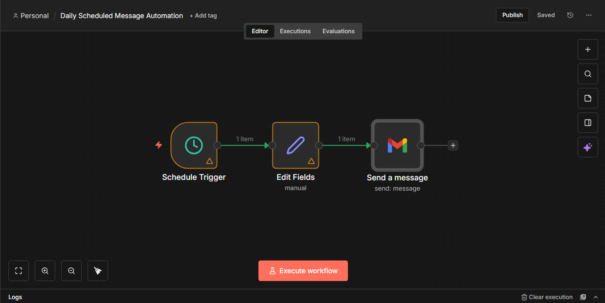

## Daily LinkedIn Posting Reminder (n8n)

### Description
A beginner-level n8n automation that sends a daily email reminder at 9 AM to post on LinkedIn.

### Problem
It’s easy to forget daily LinkedIn posting while managing other tasks.

### Solution
This workflow uses a scheduled trigger to automatically send an email reminder every day.

### Nodes Used
- Cron
- Set
- Gmail

### Features
- Runs automatically every day
- No APIs, no webhooks
- Beginner-friendly automation

### How to Use
1. Import the workflow JSON file into n8n
2. Update Gmail credentials
3. Set your preferred reminder time
4. Activate the workflow

## Screenshot

